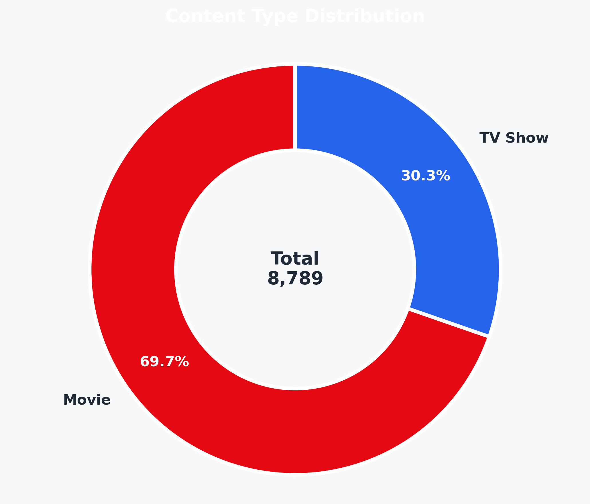
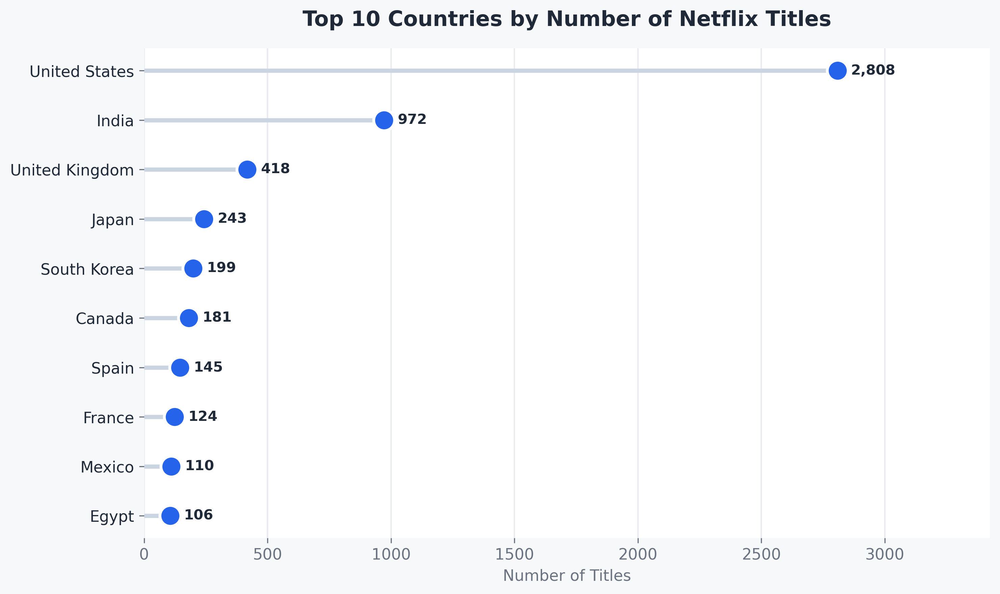
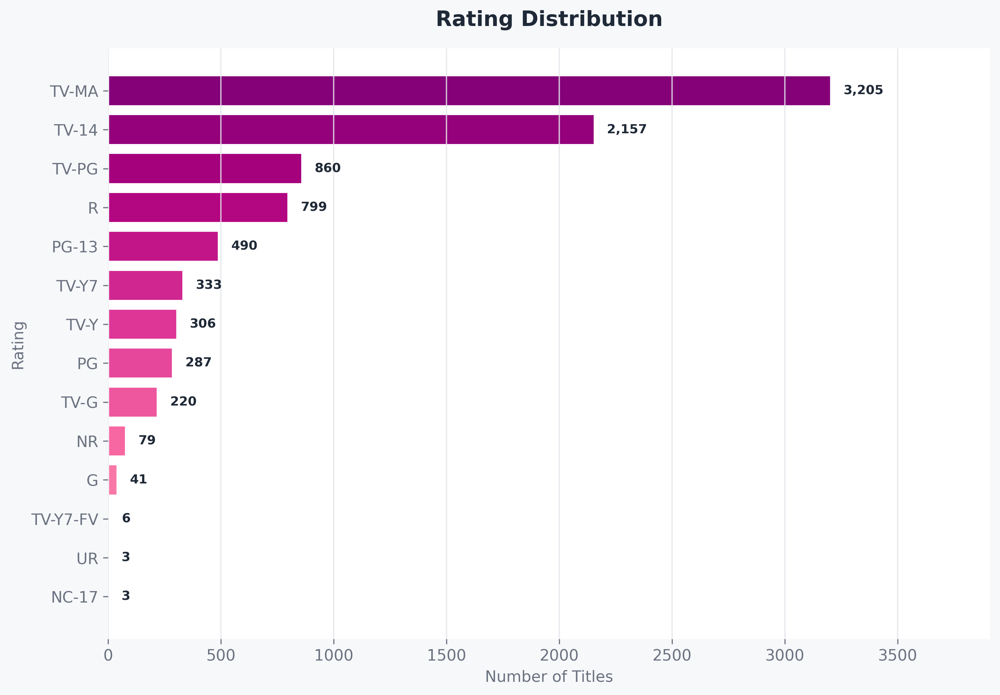
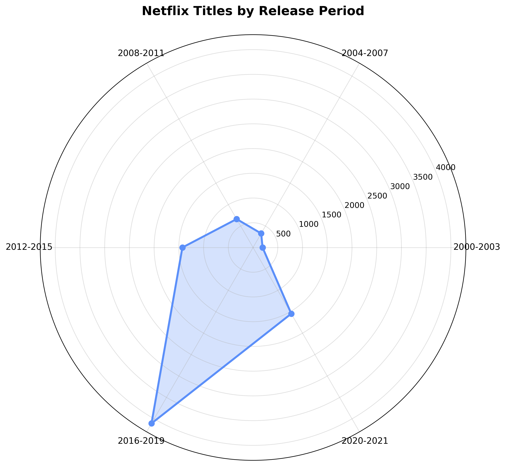
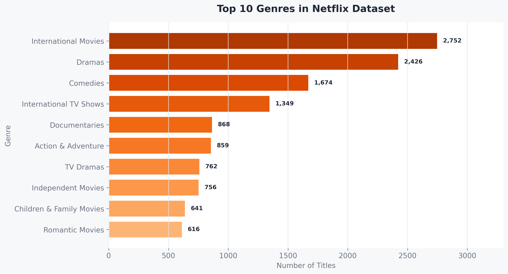
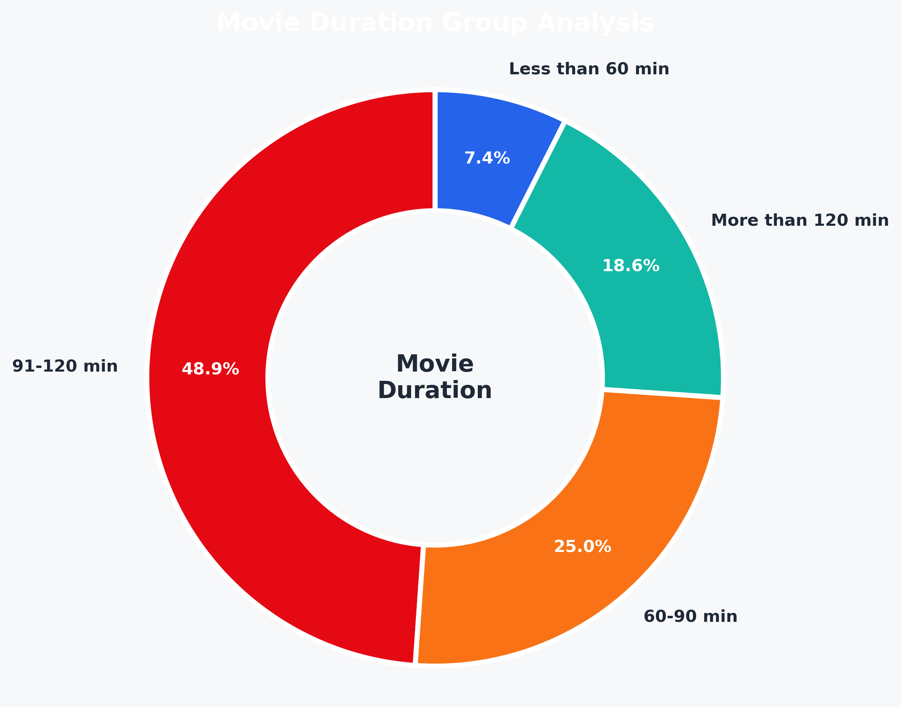

# Netflix Content Analysis Using HDFS, Hive, Zeppelin and Python

## 1. Project Overview

This project analyzes the Netflix content dataset using big data management tools and Python visualization. The main objective is to explore the structure and characteristics of Netflix titles based on content type, country, rating, release year, genre, and movie duration.

The project follows a complete data management workflow. First, the Netflix dataset was stored in HDFS. Then, Apache Hive was used to create tables, clean the dataset, and run analytical queries. Apache Zeppelin was used as the main notebook environment for executing Hive queries and documenting the analysis process. Finally, the Hive query results were exported as TSV files and visualized using Python, Pandas, and Matplotlib.

This project demonstrates how big data tools can be used together to manage, process, analyze, and present structured data.

---

## 2. Tools and Technologies Used

| Tool / Technology | Purpose                                                           |
| ----------------- | ----------------------------------------------------------------- |
| HDFS              | Used to store the Netflix dataset in a distributed file system    |
| Apache Hive       | Used to create tables, clean data, and perform SQL-based analysis |
| Apache Zeppelin   | Used as the main notebook interface for running Hive queries      |
| Python            | Used for additional visualization and result presentation         |
| Pandas            | Used to read and manage Hive output TSV files                     |
| Matplotlib        | Used to create polished visualizations                            |
| Jupyter Notebook  | Used to organize and run Python visualization code                |
| GitHub            | Used to store and present the final project files                 |

---

## 3. Dataset Description

The dataset used in this project is a Netflix content dataset. It contains information about movies and TV shows available on Netflix, including title, director, cast, country, date added, release year, rating, duration, listed genre, and description.

The main fields used in this analysis include:

| Column       | Description                                             |
| ------------ | ------------------------------------------------------- |
| show_id      | Unique ID of each Netflix title                         |
| type         | Content type, either Movie or TV Show                   |
| title        | Title of the content                                    |
| director     | Director of the content                                 |
| cast         | Main cast members                                       |
| country      | Country where the content was produced                  |
| date_added   | Date when the title was added to Netflix                |
| release_year | Original release year of the title                      |
| rating       | Age rating category                                     |
| duration     | Duration of the movie or number of seasons for TV shows |
| listed_in    | Genre categories                                        |
| description  | Short description of the title                          |

---

## 4. Data Cleaning Summary

Before analysis, the dataset was cleaned using Hive. The original dataset contained 8,809 records. After cleaning, 8,789 records were kept for analysis.

The cleaning process included checking the data structure, removing invalid or incomplete records, and preparing the data for Hive-based analysis.

| Item            | Count |
| --------------- | ----: |
| Raw records     | 8,809 |
| Cleaned records | 8,789 |
| Removed records |    20 |
| Movies          | 6,125 |
| TV Shows        | 2,664 |

The cleaned dataset was then used for all later analysis and visualization.

---

## 5. Project Workflow

The overall workflow of this project is shown below:

```text
Raw Netflix Dataset
        ↓
Upload dataset to HDFS
        ↓
Create Hive external/internal table
        ↓
Clean data using Hive queries
        ↓
Run analytical queries in Apache Zeppelin
        ↓
Export Hive query results as TSV files
        ↓
Read TSV files using Python
        ↓
Create visualizations using Pandas and Matplotlib
        ↓
Upload final code, data outputs, screenshots and visualizations to GitHub
```

This workflow shows that the main data management and analysis process was completed using HDFS, Hive, and Zeppelin. Python was used mainly to improve the visual presentation of the Hive analysis results.

---

## 6. Analysis Questions

This project focuses on the following analysis questions:

1. What is the distribution of Netflix content types?
2. Which countries produce the highest number of Netflix titles?
3. What are the most common rating categories?
4. How did the number of Netflix titles change across release years?
5. What are the most common genres in the Netflix dataset?
6. What is the distribution of movie duration groups?

---

## 7. Hive Query Output Files

The analytical results from Hive were exported as TSV files and stored in the `data/hive_outputs/` folder.

| File                             | Description                                  |
| -------------------------------- | -------------------------------------------- |
| 01_content_type_distribution.tsv | Number of titles by content type             |
| 02_top10_countries.tsv           | Top 10 countries by number of Netflix titles |
| 03_rating_distribution.tsv       | Distribution of Netflix rating categories    |
| 04_release_year_trend.tsv        | Number of titles by release year             |
| 05_top10_genres.tsv              | Top 10 genres in the dataset                 |
| 06_movie_duration_group.tsv      | Movie duration group distribution            |

These TSV files were used as the data source for the Python visualizations.

---

## 8. Analysis Results and Visualizations

### 8.1 Content Type Distribution

The analysis shows that Movies account for the majority of Netflix titles in the cleaned dataset. There are 6,125 Movies and 2,664 TV Shows.

| Content Type | Count |
| ------------ | ----: |
| Movie        | 6,125 |
| TV Show      | 2,664 |

This indicates that Netflix has more movie content than TV show content in this dataset.



---

### 8.2 Top 10 Countries by Number of Titles

The country analysis shows that the United States has the highest number of Netflix titles, followed by India and the United Kingdom.

| Rank | Country        | Count |
| ---: | -------------- | ----: |
|    1 | United States  | 2,808 |
|    2 | India          |   972 |
|    3 | United Kingdom |   418 |
|    4 | Japan          |   243 |
|    5 | South Korea    |   199 |
|    6 | Canada         |   181 |
|    7 | Spain          |   145 |
|    8 | France         |   124 |
|    9 | Mexico         |   110 |
|   10 | Egypt          |   106 |

The result suggests that Netflix content in this dataset is strongly dominated by the United States, while India and the United Kingdom also contribute a large number of titles.



---

### 8.3 Rating Distribution

The rating analysis shows that TV-MA is the most common rating category, followed by TV-14 and TV-PG.

| Rating   | Count |
| -------- | ----: |
| TV-MA    | 3,205 |
| TV-14    | 2,157 |
| TV-PG    |   860 |
| R        |   799 |
| PG-13    |   490 |
| TV-Y7    |   333 |
| TV-Y     |   306 |
| PG       |   287 |
| TV-G     |   220 |
| NR       |    79 |
| G        |    41 |
| TV-Y7-FV |     6 |
| NC-17    |     3 |
| UR       |     3 |

This result indicates that a large proportion of Netflix content is targeted at mature or older audiences.



---

### 8.4 Release Year Trend

The release year analysis shows the number of Netflix titles released from 2000 to 2021. The number of titles increased significantly after 2010 and reached a high level during the 2016–2019 period.

| Period    | Total Titles |
| --------- | -----------: |
| 2000–2003 |          192 |
| 2004–2007 |          328 |
| 2008–2011 |          664 |
| 2012–2015 |        1,429 |
| 2016–2019 |        4,107 |
| 2020–2021 |        1,545 |

The result shows that Netflix content increased rapidly in recent years, especially from 2016 to 2019.



---

### 8.5 Top 10 Genres

The genre analysis shows that International Movies is the most common genre, followed by Dramas and Comedies.

| Rank | Genre                    | Count |
| ---: | ------------------------ | ----: |
|    1 | International Movies     | 2,752 |
|    2 | Dramas                   | 2,426 |
|    3 | Comedies                 | 1,674 |
|    4 | International TV Shows   | 1,349 |
|    5 | Documentaries            |   868 |
|    6 | Action & Adventure       |   859 |
|    7 | TV Dramas                |   762 |
|    8 | Independent Movies       |   756 |
|    9 | Children & Family Movies |   641 |
|   10 | Romantic Movies          |   616 |

This indicates that Netflix provides a large amount of international content, especially international movies, dramas, and comedies.



---

### 8.6 Movie Duration Group

The movie duration analysis groups movie titles into different duration ranges.

| Duration Group    | Count |
| ----------------- | ----: |
| 91–120 min        | 2,995 |
| 60–90 min         | 1,532 |
| More than 120 min | 1,142 |
| Less than 60 min  |   456 |

Most movies are between 91 and 120 minutes long, which suggests that standard feature-length movies are the most common in the dataset.



---

## 9. Repository Structure

```text
Netflix_Content_Analysis/
├── data/
│   └── hive_outputs/
│       ├── 01_content_type_distribution.tsv
│       ├── 02_top10_countries.tsv
│       ├── 03_rating_distribution.tsv
│       ├── 04_release_year_trend.tsv
│       ├── 05_top10_genres.tsv
│       └── 06_movie_duration_group.tsv
│
├── notebooks/
│   ├── YANG_HUAN_Final_Report.json
│   └── python_visualizations.ipynb
│
├── scripts/
│   ├── hive_queries.sql
│   └── python_visualizations.py
│
├── screenshots/
│
├── visualizations/
│   ├── 01_content_type_distribution.png
│   ├── 02_top10_countries.png
│   ├── 03_rating_distribution.png
│   ├── 04_release_year_trend.png
│   ├── 05_top10_genres.png
│   └── 06_movie_duration_group.png
│
└── README.md
```

---

## 10. Description of Main Files

| File / Folder                         | Description                                                             |
| ------------------------------------- | ----------------------------------------------------------------------- |
| data/hive_outputs/                    | Stores the TSV files exported from Hive query results                   |
| notebooks/YANG_HUAN_Final_Report.json | Zeppelin notebook export file containing the main Hive analysis process |
| notebooks/python_visualizations.ipynb | Jupyter Notebook used to generate Python visualizations                 |
| scripts/hive_queries.sql              | Hive SQL queries used for the analysis                                  |
| scripts/python_visualizations.py      | Python script version of the visualization notebook                     |
| visualizations/                       | Stores the final visualization images                                   |
| screenshots/                          | Stores screenshots of important running results or system outputs       |
| README.md                             | Project explanation and documentation                                   |

---

## 11. How to Run the Project

### 11.1 Hive Analysis

The main Hive analysis was completed in Apache Zeppelin. The Hive SQL queries used in this project are saved in:

```text
scripts/hive_queries.sql
```

The Zeppelin notebook export file is saved in:

```text
notebooks/YANG_HUAN_Final_Report.json
```

### 11.2 Python Visualization

The Python visualization code is saved in two formats:

```text
notebooks/python_visualizations.ipynb
```

and

```text
scripts/python_visualizations.py
```

Before running the Python visualization code, make sure the TSV files are located in:

```text
data/hive_outputs/
```

After running the Python code, the generated charts will be saved in:

```text
visualizations/
```

---

## 12. Key Findings

The main findings of this project are:

1. Movies are the dominant content type in the Netflix dataset.
2. The United States has the highest number of Netflix titles.
3. TV-MA is the most common rating category.
4. The number of Netflix titles increased significantly after 2010.
5. The highest number of titles appeared during the 2016–2019 period.
6. International Movies, Dramas, and Comedies are the most common genres.
7. Most movies are between 91 and 120 minutes long.

---

## 13. Conclusion

This project completed a full data management and analysis workflow using HDFS, Hive, Zeppelin, and Python. The dataset was first stored and processed using big data tools. Hive was used to clean the data and generate analytical results. Apache Zeppelin was used to organize and execute the analysis process. The Hive results were then exported and visualized using Python.

Overall, the project shows how different data management tools can be combined to support data storage, data cleaning, SQL-based analysis, result export, visualization, and project documentation. The final GitHub repository contains the main analysis notebook, Hive queries, Python visualization code, exported results, and final visualizations.
